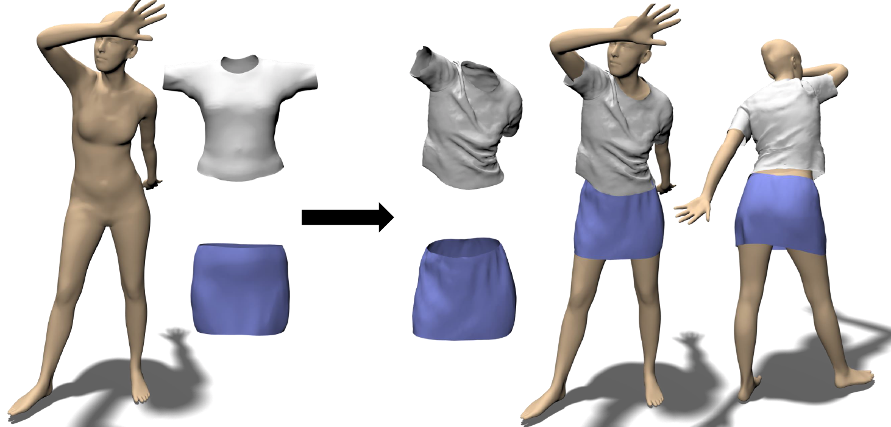
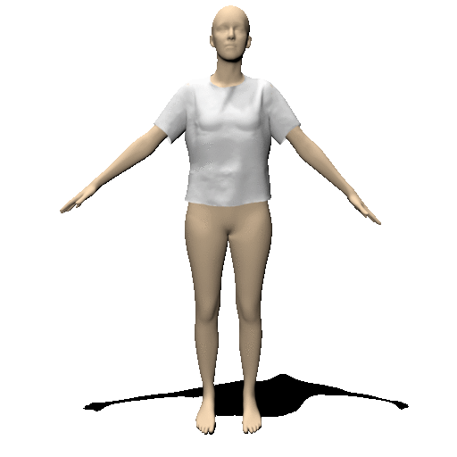
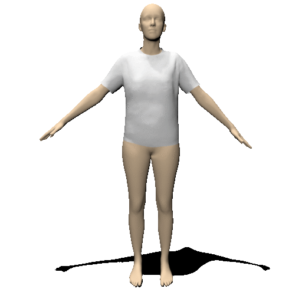
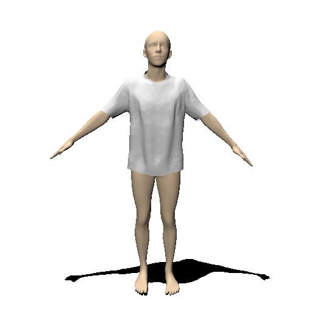

# TailorNet
This repository contains training and inference code for the following paper: 
```
TailorNet: Predicting Clothing in 3D as a Function of Human Pose, Shape and Garment Style  
Chaitanya Patel*, Zhouyingcheng Liao*, Gerard Pons-Moll  
CVPR 2020 (ORAL)  
```
[[ArXiv](https://arxiv.org/abs/2003.04583)]
[[Project Website](https://virtualhumans.mpi-inf.mpg.de/tailornet/)]
[[Dataset Repo](https://github.com/zycliao/TailorNet_dataset)]
[[Youtube](https://www.youtube.com/watch?v=F0O21a_fsBQ)]



|old-t-shirt_female|t-shirt_female|t-shirt_male|
|:--:|:--:|:--:|
||||


## Updates
- [19-07-2020] Male shirt weights added.
- [12-07-2020] Female shirt weights added.
- [28-06-2020] Female t-shirt weights added.
- [25-06-2020] Minor bug fixes and male t-shirt weights added.
- [17-06-2020] Inference script and female old-t-shirt weights added.

## Requirements
python3  
pytorch  
scipy  
[chumpy](https://github.com/mattloper/chumpy)  
[psbody.mesh](https://github.com/MPI-IS/mesh)

## How to Run
- Download and prepare SMPL model and TailorNet data from [dataset repository](https://github.com/zycliao/TailorNet_dataset).
- Set DATA_DIR and SMPL paths in `global_var.py` file accordingly.
- Download trained model weights in a directory and set its path to MODEL_WEIGHTS_PATH variable in `global_var.py`.
  - [old-t-shirt_female_weights](https://datasets.d2.mpi-inf.mpg.de/tailornet/old-t-shirt_female_weights.zip)
        (4.1 GB)
  - [t-shirt_male_weights](https://datasets.d2.mpi-inf.mpg.de/tailornet/t-shirt_male_weights.zip)
        (2.0 GB)
  - [t-shirt_female_weights](https://datasets.d2.mpi-inf.mpg.de/tailornet/t-shirt_female_weights.zip)
        (2.0 GB)
  - [shirt_female_weights](https://datasets.d2.mpi-inf.mpg.de/tailornet/shirt_female_weights.zip)
        (2.5 GB)
  - [shirt_male_weights](https://datasets.d2.mpi-inf.mpg.de/tailornet/shirt_male_weights.zip)
        (2.5 GB)
  - [Other garments coming soon]
- Set output path in `run_tailornet.py` and run it to predict garments on some random inputs. You can play with 
  different inputs. You can also run inference on motion sequence data.
- To visualize predicted garment using blender, run `python run_tailornet.py render`. (Blender needs to be installed.)

## TailorNet Per-vertex Error in mm on Test Set
... evaluated using `evaluate` function in `utils/eval.py`.
| garment_class | gender | TailorNet Baseline | TailorNet Mixture Model |
|:--:|:--:|:--:|:--:|
|  old-t-shirt  | female | 11.1 | 10.7 |
|      t-shirt  | female | 12.6 | 12.3 |
|      t-shirt  |   male | 11.4 | 11.2 |
|        shirt  | female | 14.2 | 14.1 |
|        shirt  |   male | 12.7 | 12.5 |

## Training TailorNet yourself
- Set global variables in `global_var.py`, especially LOG_DIR where training logs will be stored.
- Set config variables like gender and garment class in `trainer/base_trainer.py` (or pass them via command line)
and run `python trainer/base_trainer.py` to train TailorNet MLP baseline.
- Similarly, run `python trainer/lf_trainer.py` to train low frequency predictor and `trainer/ss2g_trainer.py` to
train shape-style-to-garment(in canonical pose) model.
- Run `python trainer/hf_trainer.py --shape_style <shape1>_<style1> <shape2>_<style2> ...` to train pivot high 
frequency predictors for pivots `<shape1>_<style1>`, `<shape2>_<style2>`, and so on. See 
`DATA_DIR/<garment_class>_<gender>/pivots.txt` to know available pivots.
- Use `models.tailornet_model.TailorNetModel` with appropriate logdir arguments to do prediction.

## Citation
Cite us if you use our model, code or data:
```
@inproceedings{patel20tailornet,
        title = {TailorNet: Predicting Clothing in 3D as a Function of Human Pose, Shape and Garment Style},
        author = {Patel, Chaitanya and Liao, Zhouyingcheng and Pons-Moll, Gerard},
        booktitle = {{IEEE} Conference on Computer Vision and Pattern Recognition (CVPR)},
        month = {jun},
        organization = {{IEEE}},
        year = {2020},
    }
```

### Misc
- Thanks to Bharat for many fruitful discussions and for `smpl_lib` library taken from his MultiGarmentNet 
repo's [lib](https://github.com/bharat-b7/MultiGarmentNetwork/tree/master/lib) folder.
- Thanks to Garvita for helping out during the onerous procedure of data generation.


For any doubt or concert about the code, raise an issue on this repository.